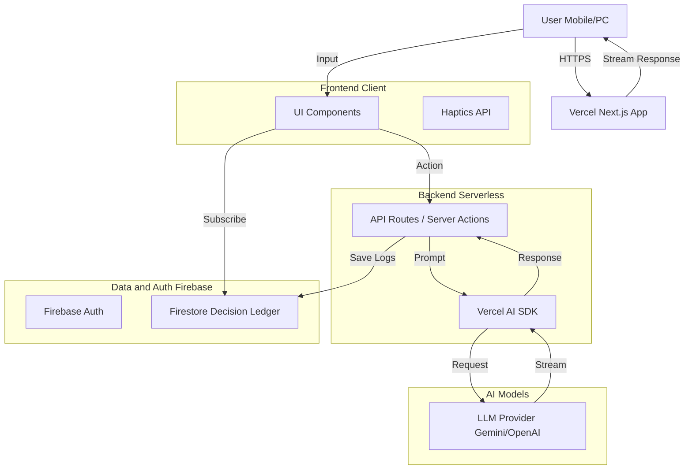

# 技術スタック選定案：MAJIレスシステム

## 目的

`doc/spec.md` に基づき、コーディング範囲と運用負荷を最小化しつつ、リッチなUI/UXと高度なマルチエージェント処理を実現する構成を提案します。

## 推奨技術スタック

### 1. アプリケーションフレームワーク: **Next.js (App Router)**

- **選定理由**:
  - **Vercel AI SDK** との親和性が高く、エージェントのストリーミング応答（Typing effect）を容易に実装可能。
  - PWA（Progressive Web App）化が容易で、モバイルアプリ開発なしでネイティブアプリに近い体験（ホーム画面追加、フルスクリーン、ハプティクスなど）を提供可能。
  - React Server Componentsにより、初期ロードを高速化。

### 2. インフラ・ホスティング: **Vercel + Firebase**

- **Web/API Hosting**: **Vercel**
  - Next.jsの最適化ホスティング。設定ゼロ（Zero Config）でデプロイ可能。運用コストほぼゼロ。
- **Backend as a Service (BaaS)**: **Firebase**
  - **Firestore**: 「意思決定台帳」およびエージェントの思考ログの保存に最適。スキーマレスで開発速度が速い。リアルタイムリスナーでUIへの即時反映が可能。
  - **Authentication**: ユーザー管理を実装なしで提供。

#### なぜ Vercel と Firebase を併用するか？

この組み合わせは「**Best of Breed（適材適所）**」のアプローチです。

1.  **Vercel (Frontend & Compute)**: Next.jsの開発元であり、SSR/ISR、Edge Middleware、画像最適化などを自動で処理します。Firebase HostingよりもNext.js機能のサポート（特にVercel AI SDKのStreaming）が充実しています。
2.  **Firebase (State & Auth)**: データベース（Firestore）と認証（Auth）に関しては、AWSやSupabaseよりもクライアントSDK（React Hooks）の完成度が高く、**リアルタイム同期**（チャットアプリの肝）が最も簡単に実装できます。
3.  **運用コストの最小化**: どちらもフルマネージド（サーバーレス）であり、インフラ管理（OS更新、パッチ適用、スケーリング設定）が一切不要です。これにより、開発者は「エージェントロジック」と「UI体験」に100%集中できます。

### 3. AI/LLM オーケストレーション: **Vercel AI SDK**

- **選定理由**:
  - `useChat` や `streamText` などのフック・関数が用意されており、LLMとの通信部分のコーディング量を大幅に削減。
  - 複数のLLMプロバイダ（OpenAI, Gemini, Anthropic等）を簡単に切り替え可能。
  - Function Calling（ツール使用）の統合が容易で、Agent B（合議）のロジック実装に適している。

### 4. UIコンポーネント: **Tailwind CSS + Shadcn/UI**

- **選定理由**:
  - **Shadcn/UI**: コピー＆ペーストで使える高品質なコンポーネント集。デザインのカスタマイズ性が高く、かつ「Premium Design」を即座に構築可能。
  - **Tailwind CSS**: CSSファイルを管理せず、クラス名だけでスタイリング完結。
  - **Lucide React**: 美しく統一感のあるアイコンセット。

## アーキテクチャ構成図

## 開発・運用フローの効率化

1.  **CI/CD**: VercelのGitHub連携により、Pushするだけで自動デプロイ。
2.  **ローカル開発**: `firebase emulators` は使わず、開発環境のFirestoreに直接接続することで環境構築の手間を省く（小規模チーム/個人の場合）。

## 懸念点と対策

### LLMコスト管理

5エージェント構成はトークン消費が多くなるため、以下の多層的な対策を講じる。

#### 基本対策：モデル選択の最適化（2026年2月時点）

| レイヤー                              | 推奨モデル             | 入力/出力コスト（per 1M tokens） | 理由                                 |
| ------------------------------------- | ---------------------- | -------------------------------- | ------------------------------------ |
| 分析層（MELCHIOR, BALTHASAR, CASPER） | Gemini 3 Flash         | $0.50 / $3.00                    | 低コストかつ高速、マルチモーダル対応 |
| 統合層                                | Gemini 3 Pro / GPT-5.2 | $2.00 / $12.00                   | 最終判断の品質を担保                 |

**代替オプション：**

- **Claude Opus 4.6**: 推論・コード品質に優れるが高コスト（$5.00 / $25.00）。重要な意思決定時の統合層として検討
- **Gemini 2.5 Flash-Lite**: 超低コスト（$0.10 / $0.40）。軽微な質問の即時回答用

#### 追加対策：コスト最適化戦略

1. **プロンプトキャッシング**
   - システムプロンプト部分をキャッシュし、入力トークンを削減
   - Gemini / Anthropic のキャッシングAPIを活用

2. **コンテキスト圧縮**
   - 過去の会話履歴は要約してからLLMに渡す
   - 直近N件のみ詳細保持、それ以前は要約に置換

3. **段階的処理（Tiered Processing）**
   - 簡単な相談 → 1エージェント（統合層のみ）で即時回答
   - 複雑な意思決定 → 5エージェント全体を起動
   - 判定基準：入力の複雑さ、ユーザー設定、または明示的な選択

4. **利用制限とプラン設計**
   - 無料枠：月間○回まで（1エージェントモード）
   - 有料プラン：5エージェントモード無制限
   - 目的：コスト予測可能性の確保とサービス持続性

5. **重要度に応じたモデル切り替え（Importance-based Model Selection）**

   分析層に安価モデル（Flash）を採用する理由：
   - 分析層は「多角的な視点の提供」が役割であり、最終判断は統合層が担う
   - 3つの独立した視点による冗長性が、個々のモデルの弱点を補完
   - アンサンブル的アプローチにより、統合後の品質を担保

   ただし、重要な意思決定では分析層も高性能モデルに切り替える：

   | ケース             | 分析層モデル | 統合層モデル |
   | ------------------ | ------------ | ------------ |
   | 日常的な相談       | Flash        | Pro          |
   | **重要な意思決定** | **Pro**      | **Pro**      |
   | 軽微な質問         | 統合層のみ   | -            |

   切り替えトリガー：
   - ユーザーが「重要」フラグを明示的に選択
   - システムが入力の複雑さ・深刻さを自動検知
   - 特定のカテゴリ（健康、法律、財務等）に該当

6. **モニタリングとアラート**
   - トークン使用量のリアルタイム監視
   - 日次/月次コストレポートの自動生成
   - 閾値超過時のアラート通知

#### コスト試算（2026年2月時点・参考）

**1リクエストあたりの想定コスト（5エージェント構成）**

- 入力: 約3,000トークン × 5 = 15,000トークン
- 出力: 約1,000トークン × 5 = 5,000トークン
- 分析層（Gemini 3 Flash × 3）: 約 $0.01
- 統合層（Gemini 3 Pro × 2）: 約 $0.13
- **合計: 約 $0.14 / リクエスト**

| 利用頻度    | 月間コスト目安 |
| ----------- | -------------- |
| 100回/月    | $14〜20        |
| 1,000回/月  | $140〜200      |
| 10,000回/月 | $1,400〜2,000  |

> [!NOTE]
> コストはトークン消費量により変動します。段階的処理やコンテキスト圧縮により大幅な削減が可能です。

---

### レイテンシ対策

順次処理だと遅くなるため、以下の対策を講じる。

- **並列実行**: 分析層の3エージェントは `Promise.all` で並列実行し、待ち時間を短縮
- **ストリーミング応答**: 各エージェントの応答をリアルタイムでUIに反映し、体感待ち時間を軽減

---

## 検証計画 (Verification Plan)

### 1. プロトタイプ検証

- Next.jsプロジェクトの立ち上げ。
- Vercel AI SDKを用いて、単純な「3人並列議論」のストリーミング出力を確認。

### 2. モバイルUX検証

- Vercelにデプロイし、スマートフォン実機でアクセス。
- PWAとしてインストールし、ハプティクス（`navigator.vibrate`）の挙動を確認。
