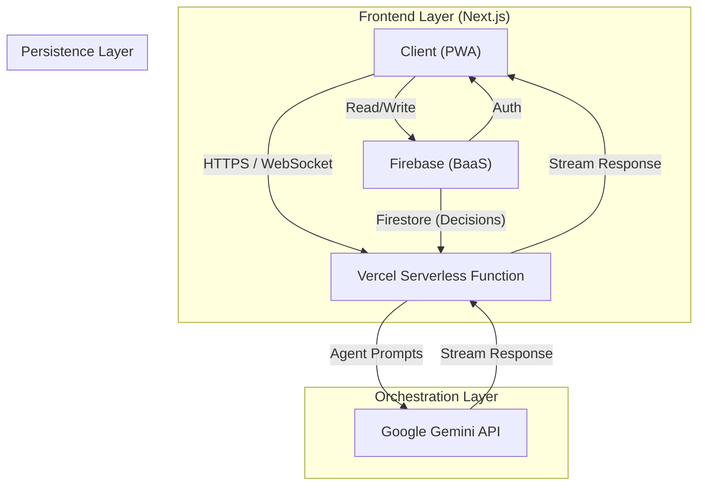
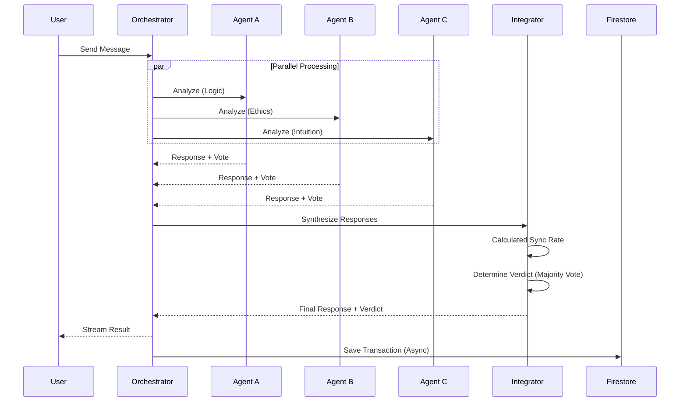
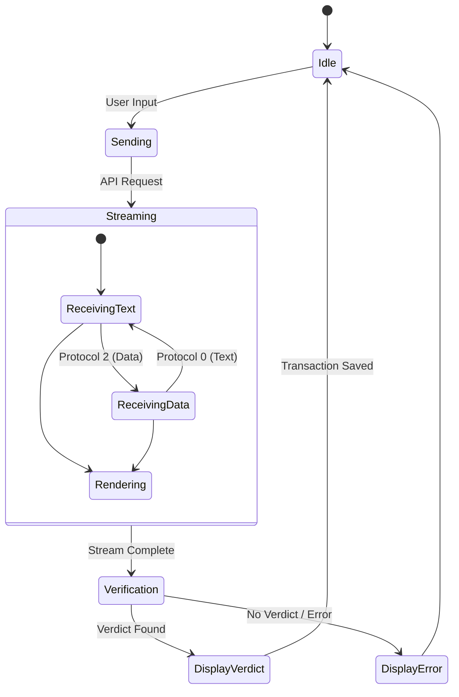
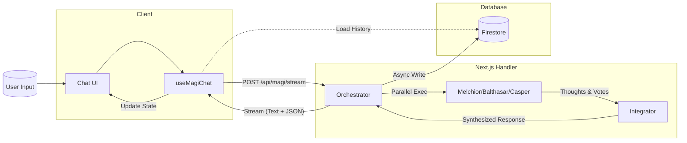
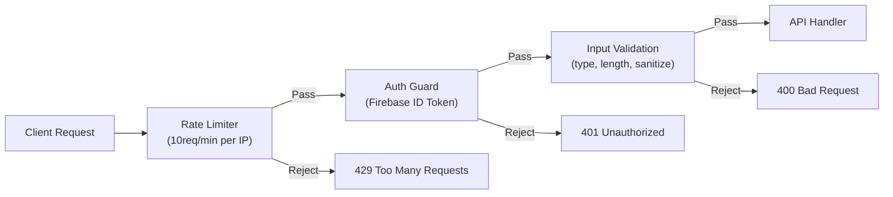

# MAJI-RES Architecture

## Overview

MAJI-RES は、3つの異なるAIエージェントによる合議制システムを採用したチャットアプリケーションです。 Next.js, Firebase, Vercel AI SDK を組み合わせ、リアルタイム性と堅牢性を両立させています。

## System Architecture



## Agent System Logic

MAJI-RES の中核となるエージェントシステムの内部ロジックです。

> **Note**: エージェントの構成は `src/lib/agents/prompts/<preset>/config.json` で定義されており、
> 環境変数 `AGENT_PRESET` でプリセットを切り替えることで、エージェントの名前・ロール・プロンプトを変更できます。
> `defaultModel` でLLMモデルを一括指定し、エージェント個別の `model` で上書きすることも可能です。
> 統合プロンプト（`synthesize.md`, `stream-synthesize.md`）もプリセットごとに個別定義されています。



## Data Flow & State Management

### 1. Chat State Machine (Client-Side)



### 2. Data Flow Diagram (DFD)



### 3. Persistence (Firestore Structure)

```
users/{userId}/
  threads/{threadId}/
    title: string
    createdAt: Timestamp
    updatedAt: Timestamp
    messages/{messageId}/
      role: "user" | "assistant"
      content: string
      timestamp: Timestamp
      metadata?: { syncRate, decision, agentResponses }
```

## PWA & Offline Strategy

- **Service Worker**: `next-pwa` を使用し、静的アセット（JS, CSS, Images）をキャッシュ。
- **Offline Indicator**: ネットワーク切断時にUI上で警告を表示。
- **Fallback**: オフライン時はキャッシュされたコンテンツを表示し、アプリの基本動作（履歴閲覧など）を維持。

## Haptic Feedback Support

モバイル体験向上のため、`navigator.vibrate` を使用した物理フィードバックを実装。
- **Send**: Medium vibration
- **Verdict (Approve)**: Success pattern (Triple pulse)
- **Verdict (Deny)**: Error pattern (Double pulse)

## Security

APIエンドポイントに対する多層防御を実装。



| レイヤー | 実装 | 内容 |
|:---|:---|:---|
| **レート制限** | `rate-limiter.ts` | IP+パスごとに 10req/min（インメモリ） |
| **認証** | `auth-guard.ts` | Firebase Auth IDトークン検証 |
| **入力検証** | 各 API route | メッセージ型・長さ（10,000文字上限） |
| **パストラバーサル防止** | `prompt-loader.ts` | プリセット名・ファイル名のサニタイズ |
| **情報漏洩防止** | `stream/route.ts` | 本番環境でスタックトレースを除外 |
