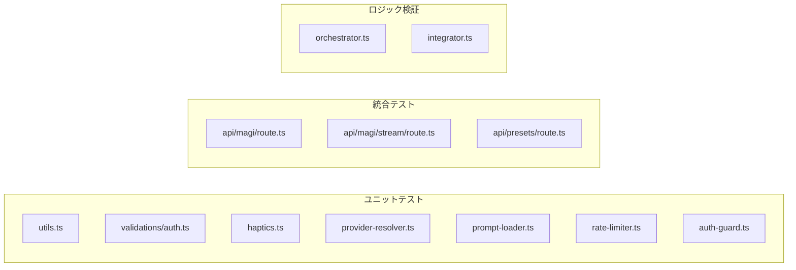
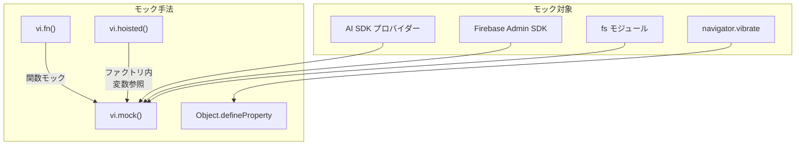

# テスト仕様書

## 概要

本プロジェクトのユニットテスト・統合テストの仕様と構成を記述する。  
テストフレームワークには **Vitest v4** を使用し、カバレッジ計測には **@vitest/coverage-v8** を採用している。

---

## テスト構成

### フレームワーク・ツール

| 項目 | 値 |
|:---|:---|
| フレームワーク | Vitest v4 |
| カバレッジ | @vitest/coverage-v8 (V8 プロバイダー) |
| 設定ファイル | `vitest.config.ts` |
| テスト配置 | ソースと同階層（`*.test.ts`） |
| 実行環境 | Node.js |

### 実行コマンド

```bash
npm test              # 全テスト実行
npm run test:watch    # ウォッチモード（ファイル変更で自動再実行）
npm run test:coverage # カバレッジ付き実行
npm run test:e2e      # E2E テスト（Playwright）
```

### カバレッジ閾値

| メトリクス | 閾値 |
|:---|:---|
| Statements | 90% |
| Lines | 90% |
| Functions | 90% |
| Branches | 75% |

---

## テスト対象マトリクス

### テスト対象



### カバレッジ除外ファイル

以下のファイルはカバレッジ計測から除外している。理由は外部サービスへの依存やLLM直接呼び出しを含み、ユニットテストでは検証不可能なためである。

| ファイル | 除外理由 |
|:---|:---|
| `firebase/admin.ts`, `firebase/client.ts` | Firebase SDK 初期化のみ |
| `services/chat-service.ts` | Firestore 直接操作 |
| `services/decision-service.ts` | Firestore 直接操作 |
| `agents/base/base-agent.ts` | LLM API 呼び出し・リトライロジック |
| `agents/integrator.ts` | LLM 呼び出し（`synthesize`, `streamSynthesize`） |
| `agents/orchestrator.ts` | LLM 経由の `process` メソッド |
| `agents/configurable-agent.ts` | BaseAgent 継承・LLM 呼び出し |
| `agents/types.ts` | 型定義のみ（実行コードなし） |
| `app/api/chat/route.ts` | レガシー API（直接 LLM 呼び出し） |
| `auth-context.tsx` | React コンテキスト（E2E で検証） |

> [!NOTE]
> 上記ファイルは E2E テスト（Playwright）または手動テストで検証する方針。

---

## テストファイル詳細

### 1. ユーティリティ

#### `src/lib/utils.test.ts`

`cn()` 関数（Tailwind CSS クラス名マージ）のテスト。

| テストケース | 検証内容 |
|:---|:---|
| クラス名結合 | 複数クラス名の結合 |
| 条件付きクラス | `false` 条件でのクラス除外 |
| Tailwind マージ | 競合クラスの上書き（`px-2` → `px-4`） |
| 空入力 | 空引数での動作 |
| null/undefined | 不正値の無視 |

---

### 2. バリデーション

#### `src/lib/validations/auth.test.ts`

Zod スキーマによるユーザー認証入力バリデーション。

| テストケース | 検証内容 |
|:---|:---|
| 正常系 | 有効なメール・パスワードの受理 |
| 不正メール | 無効なメール形式の拒否 |
| 空メール | 空文字列の拒否 |
| 短いパスワード | 8文字未満の拒否 |
| 8文字パスワード | 境界値（最小長）の受理 |
| フィールド欠落 | 必須フィールド未指定の拒否 |

---

### 3. ハプティクス

#### `src/lib/haptics.test.ts`

Vibration API を使用したハプティクスフィードバック機能のテスト。

| テストグループ | テストケース | 検証内容 |
|:---|:---|:---|
| `isHapticSupported` | navigator 未定義 | `false` 返却 |
| | vibrate 利用可能 | `true` 返却 |
| `haptic` | 非サポート環境 | `false` 返却 |
| | medium パターン | `vibrate(25)` 呼び出し |
| | success パターン | `vibrate([10,50,10,50,10])` 呼び出し |
| | vibrate エラー | 例外発生時 `false` 返却 |
| `stopHaptic` | 停止 | `vibrate(0)` 呼び出し |
| `magiHaptic` | 全イベント | `sendMessage`, `agentAppear`, `verdictApprove`, `verdictDeny`, `verdictConditional`, `buttonPress`, `reset`, `contradiction` の動作確認 |

---

### 4. プロバイダーリゾルバー

#### `src/lib/agents/provider-resolver.test.ts`

LLM プロバイダー解決関数のテスト。AI SDK モジュールをモックして検証。

| テストケース | 検証内容 |
|:---|:---|
| Google 解決 | `google` プロバイダーの正常解決 |
| OpenAI 解決 | `openai` プロバイダーの正常解決 |
| Anthropic 解決 | `anthropic` プロバイダーの正常解決 |
| 非対応プロバイダー | エラーメッセージにサポート外の旨を含む |
| エラーメッセージ | 利用可能プロバイダー一覧を含む |

---

### 5. プロンプトローダー

#### `src/lib/agents/prompts/prompt-loader.test.ts`

プリセット設定・プロンプトファイルの読み込みとセキュリティ検証。`fs` モジュールをモック。

| テストグループ | テストケース | 検証内容 |
|:---|:---|:---|
| サニタイズ | パストラバーサル (`../../etc`) | 拒否 |
| | スラッシュ含む名前 | 拒否 |
| | スペース含む名前 | 拒否 |
| | 正常なプリセット名 | 受理 |
| | ハイフン付き名前 (`MAJI-RES`) | 受理 |
| バリデーション | agents 配列未指定 | エラー |
| | 必須フィールド不足 | エラー |
| | promptFile にパストラバーサル | エラー |
| プロンプト読み込み | パストラバーサルファイル名 | 拒否 |
| | バックスラッシュファイル名 | 拒否 |
| | 正常なファイル読み込み | トリミングされた内容返却 |
| テンプレート | 変数置換 | `{{key}}` プレースホルダーの置換 |
| プリセット一覧 | 有効プリセット | ディレクトリ一覧の正常取得 |
| | config.json なし | スキップ |
| | 無効な設定 | スキップ |
| キャッシュ | loadPresetConfig | 2回目呼び出しでキャッシュ使用 |
| | loadPresetPrompt | 2回目呼び出しでキャッシュ使用 |
| | loadPrompt | 2回目呼び出しでキャッシュ使用 |
| エッジケース | 拡張子なしファイル名 | 拒否 |

---

### 6. レート制限

#### `src/lib/security/rate-limiter.test.ts`

API レート制限のスライディングウィンドウ方式テスト。`vi.useFakeTimers` 使用。

| テストケース | 検証内容 |
|:---|:---|
| 制限内リクエスト | `null` 返却（許可） |
| 制限超過 | 429 レスポンス返却 |
| Retry-After ヘッダー | ヘッダー付与の確認 |
| ウィンドウリセット | 時間経過後のリセット |
| IP 別追跡 | 異なる IP の独立管理 |
| x-real-ip フォールバック | ヘッダーフォールバック |
| IP ヘッダーなし | `unknown` へのフォールバック |
| レート制限ヘッダー | `X-RateLimit-Limit`, `X-RateLimit-Remaining` の付与 |

---

### 7. 認証ガード

#### `src/lib/security/auth-guard.test.ts`

Firebase Auth ID トークン検証のテスト。`adminAuth.verifyIdToken` をモック。

| テストケース | 検証内容 |
|:---|:---|
| Authorization ヘッダーなし | 401 返却 |
| 不正なヘッダー形式 (`Basic`) | 401 返却 |
| 空のトークン (`Bearer `) | 401 返却 |
| 有効なトークン | `{ uid }` 返却 |
| トークン検証失敗 | 401 + エラーメッセージ返却 |

---

### 8. オーケストレーター

#### `src/lib/agents/orchestrator.test.ts`

MAGI システムの合議ロジックテスト。プライベートメソッドをサブクラス経由でテスト。

| テストグループ | テストケース | 検証内容 |
|:---|:---|:---|
| `calculateSyncRate` | 同一長のレスポンス | 100% |
| | 類似長のレスポンス | 70%以上 |
| | 大幅に異なる長さ | 70%未満 |
| `determineDecision` | 賛成多数 | `APPROVE` |
| | 反対多数 | `DENY` |
| | 同数 | `CONDITIONAL` |
| | 投票なし | デフォルト `APPROVE` |
| | 全員賛成 | `APPROVE` |

---

### 9. インテグレーター

#### `src/lib/agents/integrator.test.ts`

エージェント統合ロジック（同期率計算・矛盾検出）のテスト。

| テストグループ | テストケース | 検証内容 |
|:---|:---|:---|
| `calculateSyncRate` | 全員 APPROVE | 91-100% |
| | 全員 DENY | 91% 以上 |
| | 賛成多数 | 60-70% |
| | 票分散 | 20-30% |
| `detectContradictions` | 全員賛成 | 矛盾なし |
| | 1対1 対立 | 軽度矛盾 |
| | 1対2 対立 | 重度矛盾 |
| | 対立エージェント特定 | 正確な分類 |
| | 投票なし | 矛盾なし |
| `createIntegrator` | プリセット指定 | インスタンス生成 |
| | プリセットなし | インスタンス生成 |

---

### 10. API ルート: `/api/magi`

#### `src/app/api/magi/magi-route.test.ts`

MAGI API のリクエストハンドリングテスト。全依存をモック。

| テストケース | 検証内容 |
|:---|:---|
| レート制限 | 429 レスポンス |
| 認証なし | 401 レスポンス |
| メッセージ未指定 | 400 レスポンス |
| メッセージが文字列以外 | 400 レスポンス |
| メッセージ長超過（10,000文字） | 400 レスポンス |
| 正常リクエスト | 200 + `response`, `syncRate`, `decision` |
| 内部エラー | 500 レスポンス |

---

### 11. API ルート: `/api/magi/stream`

#### `src/app/api/magi/stream/stream-route.test.ts`

ストリーミング API のリクエストハンドリングテスト。`vi.hoisted` でモック関数を作成。

| テストケース | 検証内容 |
|:---|:---|
| レート制限 | 429 レスポンス |
| 認証なし | 401 レスポンス |
| メッセージ未指定 | 400 レスポンス |
| メッセージが文字列以外 | 400 レスポンス |
| メッセージ長超過 | 400 レスポンス |
| 正常なストリーム応答 | 200 + `text/plain` Content-Type |
| プリセットパラメータ | 200 レスポンス |

---

### 12. API ルート: `/api/presets`

#### `src/app/api/presets/presets-route.test.ts`

プリセット一覧 API のテスト。

| テストケース | 検証内容 |
|:---|:---|
| プリセット一覧取得 | 200 + プリセット配列 |
| 内部エラー | 500 レスポンス |

---

## テストアーキテクチャ

### モック戦略



### 主な設計判断

| 判断 | 理由 |
|:---|:---|
| `vi.hoisted` の使用 | `vi.mock` ファクトリ内で外部変数を参照する制約への対応（`magi-route.test.ts`, `stream-route.test.ts`） |
| `vi.useFakeTimers` の使用 | レート制限のウィンドウリセットテストで時間制御が必要（`rate-limiter.test.ts`） |
| サブクラスでのプライベートメソッドテスト | `orchestrator.ts` の `calculateSyncRate`, `determineDecision` への直接アクセス |
| `vi.resetModules` の使用 | `prompt-loader.test.ts` で各テストケースのモジュールキャッシュを独立化 |

---

## 更新履歴

| 日付 | 内容 |
|:---|:---|
| 2026-02-24 | 初版作成（Vitest 導入、12テストファイル・105テスト） |
