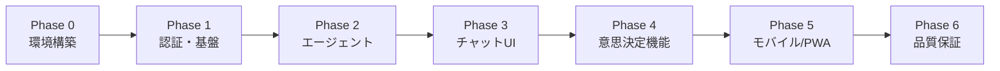

# 実装計画: MAJIレスシステム MVP

## 概要

MAJIレスシステムは、ユーザーの意思決定を支援するマルチエージェントアプリケーションです。
分析層（MELCHIOR, BALTHASAR, CASPER）、統合層（Agent B）、出力層（Agent C）の5エージェント構成により、多角的な「マジレス」を提供します。

本計画はMVP開発のため、6つのフェーズに分けて段階的に実装を進めます。

---

## 前提条件

- 新規プロジェクトとして開始（既存コードベースなし）
- 開発者はKVS環境で作業
- Node.js / npm がインストール済み
- Firebase / Vercel アカウントは別途準備

---

## フェーズ構成と優先度



---

## Phase 0: 環境構築（🔴 高優先度）

### 概要

Next.js App Router ベースの開発環境を構築し、必要なライブラリとインフラ接続の初期設定を行う。

### タスク一覧

| ID       | タスク名                                 | サイズ | 工数見積 |
| -------- | ---------------------------------------- | ------ | -------- |
| P0-T-001 | Next.js プロジェクト初期化（App Router） | S      | 30分     |
| P0-T-002 | Tailwind CSS + Shadcn/UI セットアップ    | S      | 1時間    |
| P0-T-003 | ディレクトリ構造の策定と整備             | XS     | 30分     |
| P0-T-004 | Firebase プロジェクト作成・SDK設定       | S      | 1時間    |
| P0-T-005 | Vercel AI SDK 初期設定                   | S      | 1時間    |
| P0-T-006 | 環境変数・設定ファイル整備               | XS     | 30分     |
| P0-T-007 | Vercel デプロイ設定・GitHub連携          | S      | 30分     |
| P0-T-008 | ESLint/Prettier 設定                     | XS     | 30分     |

### 技術詳細

#### ディレクトリ構造（DesignRules.md準拠）

```
app/
  (auth)/login/page.tsx
  (chat)/
    page.tsx
    _components/
    _lib/
    _actions.ts
  api/
components/ui/
lib/
  firebase/
  utils.ts
```

#### 環境変数

```env
# Firebase Client
NEXT_PUBLIC_FIREBASE_API_KEY=
NEXT_PUBLIC_FIREBASE_AUTH_DOMAIN=
NEXT_PUBLIC_FIREBASE_PROJECT_ID=

# Firebase Admin
FIREBASE_SERVICE_ACCOUNT_KEY=

# AI SDK
GOOGLE_GENERATIVE_AI_API_KEY=
```

### 依存関係

- なし（最初のフェーズ）

---

## Phase 1: 認証・基盤機能（🔴 高優先度）

### 概要

Firebase Auth を統合し、ユーザー認証と共通レイアウトを実装する。

### タスク一覧

| ID       | タスク名                       | サイズ | 工数見積 |
| -------- | ------------------------------ | ------ | -------- |
| P1-T-001 | Firebase Auth 初期化・設定     | S      | 1時間    |
| P1-T-002 | useAuth フック作成（Context）  | S      | 1.5時間  |
| P1-T-003 | Google ログイン実装            | S      | 1時間    |
| P1-T-004 | Email/Password ログイン実装    | S      | 1.5時間  |
| P1-T-005 | 認証ガード（ProtectedRoute）   | S      | 1時間    |
| P1-T-006 | ログイン/サインアップ画面UI    | M      | 2時間    |
| P1-T-007 | 共通レイアウト・ナビゲーション | M      | 2時間    |
| P1-T-008 | ユーザープロフィール表示       | S      | 1時間    |
| P1-T-009 | Zod スキーマ基盤（入力検証）   | S      | 1時間    |
| P1-T-010 | Error Boundary コンポーネント  | S      | 1時間    |
| P1-T-011 | Toast 通知基盤（sonner）       | XS     | 30分     |

### 技術詳細

- **Client SDK**: `firebase/auth` でクライアント認証
- **Admin SDK**: Server Actions 内での特権操作用
- **Session管理**: Cookie ベースのセッション管理

### 依存関係

- P0-T-004 (Firebase設定) が必須

---

## Phase 2: コアエージェント機能（🔴 高優先度）

### 概要

5エージェント構成のマルチエージェントシステムを実装。分析層 → 統合層 → 出力層のパイプラインを構築する。

### タスク一覧

| ID       | タスク名                              | サイズ | 工数見積 |
| -------- | ------------------------------------- | ------ | -------- |
| P2-T-001 | エージェント基底クラス/型定義         | M      | 2時間    |
| P2-T-002 | MELCHIOR（肯定的視点）プロンプト設計  | S      | 1時間    |
| P2-T-003 | BALTHASAR（批判的視点）プロンプト設計 | S      | 1時間    |
| P2-T-004 | CASPER（中立的視点）プロンプト設計    | S      | 1時間    |
| P2-T-005 | 分析層並列実行ロジック（Promise.all） | M      | 2時間    |
| P2-T-006 | Agent B（統合層）ロジック実装         | M      | 3時間    |
| P2-T-007 | Agent C（出力層・トーン変換）実装     | M      | 2時間    |
| P2-T-008 | エージェント間オーケストレーション    | M      | 3時間    |
| P2-T-009 | ストリーミング応答対応（StreamData）  | M      | 2時間    |

### 技術詳細

#### エージェント構成

```typescript
// 分析層: 並列実行
const analysisResults = await Promise.all([
  runAgent(MELCHIOR, input),
  runAgent(BALTHASAR, input),
  runAgent(CASPER, input),
]);

// 統合層: 合議処理
const synthesis = await runAgentB(analysisResults);

// 出力層: トーン変換
const output = await runAgentC(synthesis, selectedPersona);
```

#### コスト最適化

| レイヤー | モデル       | 理由               |
| -------- | ------------ | ------------------ |
| 分析層   | Gemini Flash | 低コスト・高速     |
| 統合層   | Gemini Pro   | 最終判断の品質確保 |

### 依存関係

- P0-T-005 (AI SDK設定) が必須

---

## Phase 3: チャット・UI機能（🟡 中優先度）

### 概要

チャットインターフェースとリアルタイム応答表示を実装。

### タスク一覧

| ID       | タスク名                                       | サイズ | 工数見積 |
| -------- | ---------------------------------------------- | ------ | -------- |
| P3-T-001 | チャット入力コンポーネント                     | M      | 2時間    |
| P3-T-002 | メッセージバブルコンポーネント                 | S      | 1.5時間  |
| P3-T-003 | レイヤード・スタック表示（3者並列）            | M      | 3時間    |
| P3-T-004 | ストリーミング応答表示（タイピングエフェクト） | M      | 2時間    |
| P3-T-005 | シンクロ率表示（六角形アイコン）               | M      | 2時間    |
| P3-T-006 | 判定演出（可決/否決オーバーレイ）              | M      | 2.5時間  |
| P3-T-007 | チャット履歴の保存・取得（Firestore）          | M      | 2時間    |

### 技術詳細

- **useChat**: Vercel AI SDK のフックでチャット状態管理
- **StreamData**: エージェントのメタデータ（シンクロ率等）を別チャネルで送信
- **Firestore onSnapshot**: リアルタイム同期でUIを即時更新

### 依存関係

- P2 (エージェント機能) 完了後

---

## Phase 4: 意思決定機能（🟡 中優先度）

### 概要

合議ロジック、深掘りアルゴリズム、矛盾検知などのビジネスロジックを実装。

### タスク一覧

| ID       | タスク名                            | サイズ | 工数見積 |
| -------- | ----------------------------------- | ------ | -------- |
| P4-T-001 | 意思決定台帳（Decision Ledger）設計 | M      | 2時間    |
| P4-T-002 | Firestore スキーマ実装              | S      | 1.5時間  |
| P4-T-003 | 合議ロジック：多数決                | S      | 1時間    |
| P4-T-004 | 合議ロジック：全会一致              | S      | 1時間    |
| P4-T-005 | 深掘り（逆質問）アルゴリズム        | M      | 3時間    |
| P4-T-006 | 矛盾検知ロジック                    | M      | 2.5時間  |
| P4-T-007 | リセットフロー（ちゃぶ台返し対応）  | M      | 2時間    |
| P4-T-008 | コンテクスト有効期限管理（168時間） | S      | 1時間    |

### 技術詳細

#### Decision Ledger スキーマ

```typescript
interface DecisionLedger {
  userId: string;
  sessionId: string;
  round: number;
  decisions: Decision[];
  openQuestions: string[];
  updatedAt: Timestamp;
  expiresAt: Timestamp; // 168時間後
}
```

### 依存関係

- P2-T-006 (Agent B) に統合

---

## Phase 5: モバイル最適化・PWA（🟢 低優先度）

### 概要

モバイル体験の最適化とPWA対応を実装。

### タスク一覧

| ID       | タスク名                         | サイズ | 工数見積 |
| -------- | -------------------------------- | ------ | -------- |
| P5-T-001 | レスポンシブデザイン調整         | M      | 3時間    |
| P5-T-002 | PWA マニフェスト設定             | S      | 1時間    |
| P5-T-003 | Service Worker（next-pwa）       | M      | 2時間    |
| P5-T-004 | ハプティクスフィードバック実装   | S      | 1.5時間  |
| P5-T-005 | オフライン対応（キャッシュ戦略） | M      | 2時間    |
| P5-T-006 | Touch Gesture最適化              | S      | 1時間    |

### 技術詳細

- **PWA**: `next-pwa` で Service Worker 自動生成
- **Haptics**: `navigator.vibrate()` API
- **Responsive**: `h-dvh` (Dynamic Viewport Height) 活用

### 依存関係

- P3 (チャットUI) 完了後

---

## Phase 6: 品質保証・リリース（🟡 中優先度）

### 概要

テスト、パフォーマンス最適化、セキュリティ監査を実施し、本番リリースへ。

### タスク一覧

| ID       | タスク名                               | サイズ | 工数見積 |
| -------- | -------------------------------------- | ------ | -------- |
| P6-T-001 | ユニットテスト（エージェントロジック） | M      | 3時間    |
| P6-T-002 | 統合テスト（E2Eフロー）                | M      | 3時間    |
| P6-T-003 | パフォーマンス最適化（Lighthouse）     | M      | 2時間    |
| P6-T-004 | セキュリティ監査（Firestore Rules）    | M      | 2時間    |
| P6-T-005 | 本番環境設定・デプロイ                 | S      | 1時間    |

### 検証方法

| テスト種別  | ツール/方法              | 対象                                 |
| ----------- | ------------------------ | ------------------------------------ |
| Unit Test   | Vitest                   | エージェントロジック、ユーティリティ |
| E2E Test    | Playwright               | ログイン〜チャット〜判定フロー       |
| Performance | Lighthouse               | Core Web Vitals                      |
| Security    | Firebase Rules Simulator | Firestore ACL                        |

---

## リスクと対策

| リスク             | 影響度 | 対策                                 |
| ------------------ | ------ | ------------------------------------ |
| LLMコスト超過      | 高     | 段階的処理、モニタリングアラート設置 |
| ストリーミング遅延 | 中     | 分析層並列化、Edge Runtime活用       |
| Firestore制限超過  | 中     | バッチ書き込み、読み取りキャッシュ   |
| 認証セキュリティ   | 高     | Firebase Security Rules厳格化        |

---

## サマリー

| フェーズ | タスク数 | 概算工数       |
| -------- | -------- | -------------- |
| Phase 0  | 8        | 5.5時間        |
| Phase 1  | 11       | 13.5時間       |
| Phase 2  | 9        | 17時間         |
| Phase 3  | 7        | 15時間         |
| Phase 4  | 8        | 14時間         |
| Phase 5  | 6        | 10.5時間       |
| Phase 6  | 5        | 11時間         |
| **合計** | **54**   | **約86.5時間** |

> [!IMPORTANT]
> 本計画はMVP開発用です。工数はあくまで目安であり、実装中に発見された技術的課題により変動する可能性があります。

---

## 次のアクション

1. **Phase 0 環境構築** から着手
2. タスク管理エージェントへの引き継ぎ → タスクボード作成
