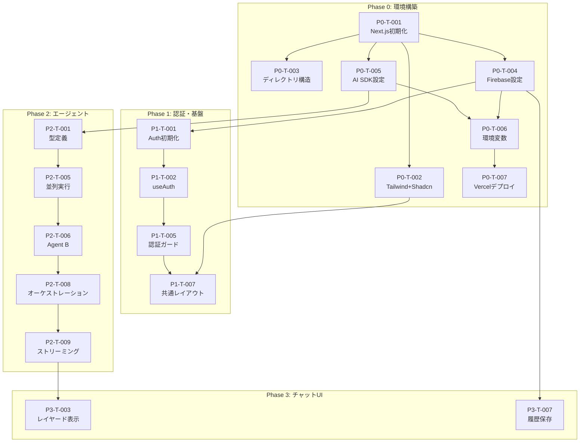

# タスクボード: MAJIレスシステム MVP

> **更新日**: 2026-02-08  
> **総タスク数**: 54  
> **完了**: 18 / 54

---

## 📋 バックログ

### Phase 0: 環境構築 [8/8]

- [x] **[P0-T-001]** Next.js プロジェクト初期化
  - サイズ: S | 優先度: 🔴 高 | 見積: 30分
  - 完了条件:
    - [x] `npx create-next-app@latest` で App Router 構成
    - [x] 初期ビルド成功確認
  - 依存: なし

- [x] **[P0-T-002]** Tailwind CSS + Shadcn/UI セットアップ
  - サイズ: S | 優先度: 🔴 高 | 見積: 1時間
  - 完了条件:
    - [x] Tailwind CSS 設定完了
    - [x] Shadcn/UI 初期化 (`npx shadcn@latest init`)
    - [x] Button, Card 等の基本コンポーネント追加
  - 依存: P0-T-001

- [x] **[P0-T-003]** ディレクトリ構造の策定と整備
  - サイズ: XS | 優先度: 🔴 高 | 見積: 30分
  - 完了条件:
    - [x] `DesignRules.md` に準拠した構造を作成
    - [x] `app/(auth)`, `app/(chat)`, `lib/`, `components/ui/` 作成
  - 依存: P0-T-001

- [x] **[P0-T-004]** Firebase プロジェクト作成・SDK設定
  - サイズ: S | 優先度: 🔴 高 | 見積: 1時間
  - 完了条件:
    - [x] Firebase Console でプロジェクト作成
    - [x] `lib/firebase/client.ts` 初期化コード作成
    - [x] `lib/firebase/admin.ts` Admin SDK 設定
  - 依存: P0-T-001

- [x] **[P0-T-005]** Vercel AI SDK 初期設定
  - サイズ: S | 優先度: 🔴 高 | 見積: 1時間
  - 完了条件:
    - [x] `ai` パッケージインストール
    - [x] Gemini プロバイダ設定
    - [x] 簡単な動作確認（echo テスト）
  - 依存: P0-T-001

- [x] **[P0-T-006]** 環境変数・設定ファイル整備
  - サイズ: XS | 優先度: 🔴 高 | 見積: 30分
  - 完了条件:
    - [x] `.env.local.example` 作成
    - [x] `.env.local` に必要変数設定
    - [x] `next.config.js` 整備
  - 依存: P0-T-004, P0-T-005

- [x] **[P0-T-007]** Vercel デプロイ設定・GitHub連携
  - サイズ: S | 優先度: 🟡 中 | 見積: 30分
  - 完了条件:
    - [x] GitHub リポジトリ連携
    - [x] Vercel プロジェクト作成
    - [x] 初回デプロイ成功
  - 依存: P0-T-006

- [x] **[P0-T-008]** ESLint/Prettier 設定
  - サイズ: XS | 優先度: 🔴 高 | 見積: 30分
  - 完了条件:
    - [x] ESLint 設定ファイル作成（`.eslintrc.json`）
    - [x] Prettier 設定ファイル作成（`.prettierrc`）
    - [x] npm scripts 設定（`lint`, `format`）
  - 依存: P0-T-001

---

### Phase 1: 認証・基盤機能 [10/11]

- [x] **[P1-T-001]** Firebase Auth 初期化・設定
  - サイズ: S | 優先度: 🔴 高 | 見積: 1時間
  - 依存: P0-T-004

- [x] **[P1-T-002]** useAuth フック作成（Context）
  - サイズ: S | 優先度: 🔴 高 | 見積: 1.5時間
  - 依存: P1-T-001

- [x] **[P1-T-003]** Google ログイン実装
  - サイズ: S | 優先度: 🔴 高 | 見積: 1時間
  - 依存: P1-T-002

- [ ] **[P1-T-004]** Email/Password ログイン実装
  - サイズ: S | 優先度: 🟡 中 | 見積: 1.5時間
  - 依存: P1-T-002

- [x] **[P1-T-005]** 認証ガード（ProtectedRoute）
  - サイズ: S | 優先度: 🔴 高 | 見積: 1時間
  - 依存: P1-T-002

- [x] **[P1-T-006]** ログイン/サインアップ画面UI
  - サイズ: M | 優先度: 🔴 高 | 見積: 2時間
  - 依存: P0-T-002, P1-T-003

- [x] **[P1-T-007]** 共通レイアウト・ナビゲーション
  - サイズ: M | 優先度: 🔴 高 | 見積: 2時間
  - 依存: P0-T-002, P1-T-005

- [x] **[P1-T-008]** ユーザープロフィール表示
  - サイズ: S | 優先度: 🟢 低 | 見積: 1時間
  - 依存: P1-T-007

- [x] **[P1-T-009]** Zod スキーマ基盤（入力検証）
  - サイズ: S | 優先度: 🔴 高 | 見積: 1時間
  - 完了条件:
    - [x] Zod パッケージインストール
    - [x] 共通バリデーションスキーマ作成（`lib/validations/`）
    - [x] 認証フォーム用スキーマ実装
  - 依存: P0-T-001

- [x] **[P1-T-010]** Error Boundary コンポーネント
  - サイズ: S | 優先度: 🔴 高 | 見積: 1時間
  - 完了条件:
    - [x] `components/error-boundary.tsx` 作成
    - [x] フォールバックUI実装
    - [x] ルートレイアウトへの適用
  - 依存: P0-T-002

- [x] **[P1-T-011]** Toast 通知基盤（sonner）
  - サイズ: XS | 優先度: 🔴 高 | 見積: 30分
  - 完了条件:
    - [x] sonner パッケージインストール
    - [x] Toaster コンポーネントをルートに配置
    - [x] 成功/エラー通知のヘルパー関数作成
  - 依存: P0-T-002

---

### Phase 2: コアエージェント機能 [0/9]

- [ ] **[P2-T-001]** エージェント基底クラス/型定義
  - サイズ: M | 優先度: 🔴 高 | 見積: 2時間
  - 依存: P0-T-005

- [ ] **[P2-T-002]** MELCHIOR プロンプト設計
  - サイズ: S | 優先度: 🔴 高 | 見積: 1時間
  - 依存: P2-T-001

- [ ] **[P2-T-003]** BALTHASAR プロンプト設計
  - サイズ: S | 優先度: 🔴 高 | 見積: 1時間
  - 依存: P2-T-001

- [ ] **[P2-T-004]** CASPER プロンプト設計
  - サイズ: S | 優先度: 🔴 高 | 見積: 1時間
  - 依存: P2-T-001

- [ ] **[P2-T-005]** 分析層並列実行ロジック
  - サイズ: M | 優先度: 🔴 高 | 見積: 2時間
  - 依存: P2-T-002, P2-T-003, P2-T-004

- [ ] **[P2-T-006]** Agent B（統合層）ロジック実装
  - サイズ: M | 優先度: 🔴 高 | 見積: 3時間
  - 依存: P2-T-005

- [ ] **[P2-T-007]** Agent C（出力層）実装
  - サイズ: M | 優先度: 🔴 高 | 見積: 2時間
  - 依存: P2-T-006

- [ ] **[P2-T-008]** エージェント間オーケストレーション
  - サイズ: M | 優先度: 🔴 高 | 見積: 3時間
  - 依存: P2-T-007

- [ ] **[P2-T-009]** ストリーミング応答対応
  - サイズ: M | 優先度: 🔴 高 | 見積: 2時間
  - 依存: P2-T-008

---

### Phase 3: チャット・UI機能 [0/7]

- [ ] **[P3-T-001]** チャット入力コンポーネント
  - サイズ: M | 優先度: 🔴 高 | 見積: 2時間
  - 依存: P1-T-007

- [ ] **[P3-T-002]** メッセージバブルコンポーネント
  - サイズ: S | 優先度: 🔴 高 | 見積: 1.5時間
  - 依存: P0-T-002

- [ ] **[P3-T-003]** レイヤード・スタック表示
  - サイズ: M | 優先度: 🔴 高 | 見積: 3時間
  - 依存: P2-T-009, P3-T-002

- [ ] **[P3-T-004]** ストリーミング応答表示
  - サイズ: M | 優先度: 🔴 高 | 見積: 2時間
  - 依存: P3-T-003

- [ ] **[P3-T-005]** シンクロ率表示
  - サイズ: M | 優先度: 🟡 中 | 見積: 2時間
  - 依存: P2-T-006

- [ ] **[P3-T-006]** 判定演出（可決/否決）
  - サイズ: M | 優先度: 🟡 中 | 見積: 2.5時間
  - 依存: P2-T-006

- [ ] **[P3-T-007]** チャット履歴保存（Firestore）
  - サイズ: M | 優先度: 🔴 高 | 見積: 2時間
  - 依存: P0-T-004, P3-T-001

---

### Phase 4: 意思決定機能 [0/8]

- [ ] **[P4-T-001]** Decision Ledger 設計
  - サイズ: M | 優先度: 🔴 高 | 見積: 2時間
  - 依存: P2-T-006

- [ ] **[P4-T-002]** Firestore スキーマ実装
  - サイズ: S | 優先度: 🔴 高 | 見積: 1.5時間
  - 依存: P4-T-001

- [ ] **[P4-T-003]** 合議ロジック：多数決
  - サイズ: S | 優先度: 🔴 高 | 見積: 1時間
  - 依存: P4-T-002

- [ ] **[P4-T-004]** 合議ロジック：全会一致
  - サイズ: S | 優先度: 🟡 中 | 見積: 1時間
  - 依存: P4-T-002

- [ ] **[P4-T-005]** 深掘り（逆質問）アルゴリズム
  - サイズ: M | 優先度: 🔴 高 | 見積: 3時間
  - 依存: P2-T-006

- [ ] **[P4-T-006]** 矛盾検知ロジック
  - サイズ: M | 優先度: 🟡 中 | 見積: 2.5時間
  - 依存: P4-T-002

- [ ] **[P4-T-007]** リセットフロー
  - サイズ: M | 優先度: 🟡 中 | 見積: 2時間
  - 依存: P4-T-006

- [ ] **[P4-T-008]** コンテクスト有効期限管理
  - サイズ: S | 優先度: 🟢 低 | 見積: 1時間
  - 依存: P4-T-002

---

### Phase 5: モバイル最適化・PWA [0/6]

- [ ] **[P5-T-001]** レスポンシブデザイン調整
  - サイズ: M | 優先度: 🟡 中 | 見積: 3時間
  - 依存: P3-T-003

- [ ] **[P5-T-002]** PWA マニフェスト設定
  - サイズ: S | 優先度: 🟡 中 | 見積: 1時間
  - 依存: P0-T-007

- [ ] **[P5-T-003]** Service Worker 設定
  - サイズ: M | 優先度: 🟡 中 | 見積: 2時間
  - 依存: P5-T-002

- [ ] **[P5-T-004]** ハプティクスフィードバック
  - サイズ: S | 優先度: 🟢 低 | 見積: 1.5時間
  - 依存: P3-T-006

- [ ] **[P5-T-005]** オフライン対応
  - サイズ: M | 優先度: 🟢 低 | 見積: 2時間
  - 依存: P5-T-003

- [ ] **[P5-T-006]** Touch Gesture 最適化
  - サイズ: S | 優先度: 🟢 低 | 見積: 1時間
  - 依存: P3-T-001

---

### Phase 6: 品質保証・リリース [0/5]

- [ ] **[P6-T-001]** ユニットテスト
  - サイズ: M | 優先度: 🔴 高 | 見積: 3時間
  - 依存: P2-T-008

- [ ] **[P6-T-002]** E2E 統合テスト
  - サイズ: M | 優先度: 🔴 高 | 見積: 3時間
  - 依存: P3-T-007

- [ ] **[P6-T-003]** パフォーマンス最適化
  - サイズ: M | 優先度: 🟡 中 | 見積: 2時間
  - 依存: P5-T-001

- [ ] **[P6-T-004]** セキュリティ監査
  - サイズ: M | 優先度: 🔴 高 | 見積: 2時間
  - 依存: P1-T-005, P4-T-002

- [ ] **[P6-T-005]** 本番デプロイ
  - サイズ: S | 優先度: 🔴 高 | 見積: 1時間
  - 依存: P6-T-001〜P6-T-004

---

## 🔄 進行中

（なし）

---

## 👀 レビュー待ち

- **Phase 0 & 1 完了報告**: `walkthrough.md` を作成しました。

---

## ✅ 完了

- [P0-T-001] Next.js プロジェクト初期化
- [P0-T-002] Tailwind CSS + Shadcn/UI セットアップ
- [P0-T-003] ディレクトリ構造の策定と整備
- [P0-T-004] Firebase プロジェクト作成・SDK設定
- [P0-T-005] Vercel AI SDK 初期設定
- [P0-T-006] 環境変数・設定ファイル整備
- [P0-T-007] Vercel デプロイ設定・GitHub連携
- [P0-T-008] ESLint/Prettier 設定
- [P1-T-001] Firebase Auth 初期化・設定
- [P1-T-002] useAuth フック作成
- [P1-T-003] Google ログイン実装
- [P1-T-005] 認証ガード実装
- [P1-T-006] ログイン画面UI
- [P1-T-007] 共通レイアウト
- [P1-T-008] ユーザープロフィール
- [P1-T-009] Zod スキーマ基盤
- [P1-T-010] Error Boundary
- [P1-T-011] Toast 通知基盤

---

## 依存関係グラフ



---

## クリティカルパス

```
P0-T-001 → P0-T-005 → P2-T-001 → P2-T-005 → P2-T-006 → P2-T-008 → P2-T-009 → P3-T-003
```

**所要時間目安**: 約17時間（クリティカルパス上のタスクのみ）
